# Diagramme de classes UML - MoneyMate

Ce diagramme represente la structure principale du projet MAUI/MVVM MoneyMate :

- couche presentation : `Views` et `ViewModels`
- couche metier : services applicatifs et contrats
- couche persistance : contexte SQLite et repository generique
- modele de domaine : utilisateur, categories, depenses, budgets, charges fixes et alertes

```mermaid
classDiagram
direction LR

%% =========================
%% Domaine / MERISE
%% =========================
class User {
  +int Id
  +string Email
  +string PasswordHash
  +string Devise
  +int BudgetStartDay
  +string Role
  +bool IsActive
  +DateTime CreatedAt
}

class Category {
  +int Id
  +int? UserId
  +int? ParentCategoryId
  +bool IsSystem
  +string Name
  +string Description
  +string Color
  +string Icon
  +int DisplayOrder
  +bool IsActive
  +DateTime CreatedAt
  +List~Expense~ Expenses
}

class Expense {
  +int Id
  +int UserId
  +DateTime DateOperation
  +decimal Amount
  +int CategoryId
  +string Note
  +bool IsFixedCharge
  +User? User
  +Category? Category
}

class Budget {
  +int Id
  +int UserId
  +decimal Amount
  +string PeriodType
  +DateTime StartDate
  +DateTime? EndDate
  +bool IsActive
  +DateTime CreatedAt
  +int CategoryId
  +int Year
  +int Month
  +string MonthLabel
  +NormalizeToMonthlyPeriod()
  +CalculateBudgetPercentage(decimal) decimal
}

class FixedCharge {
  +int Id
  +int UserId
  +string Name
  +string Description
  +decimal Amount
  +int CategoryId
  +string Frequency
  +int DayOfMonth
  +DateTime StartDate
  +DateTime? EndDate
  +bool IsActive
  +bool AutoCreateExpense
  +DateTime CreatedAt
  +GetNextOccurrenceDate() DateTime
}

class AlertThreshold {
  +int Id
  +int UserId
  +int? BudgetId
  +int? CategoryId
  +decimal ThresholdPercentage
  +string AlertType
  +string Message
  +bool IsActive
  +bool SendNotification
  +DateTime CreatedAt
}

User "1" --> "0..*" Expense : possede
User "1" --> "0..*" Budget : definit
User "1" --> "0..*" FixedCharge : configure
User "1" --> "0..*" AlertThreshold : parametre
User "0..1" --> "0..*" Category : categories personnalisees
Category "1" --> "0..*" Expense : classe
Category "1" --> "0..*" Budget : cible
Category "1" --> "0..*" FixedCharge : classe
Category "0..1" --> "0..*" AlertThreshold : surveille
Category "0..1" --> "0..*" Category : override systeme
Budget "0..1" --> "0..*" AlertThreshold : declenche

%% =========================
%% Persistance
%% =========================
class IMoneyMateDbContext {
  <<interface>>
  +EnsureCreated()
  +GetUsers() List~User~
  +GetCategoriesByUserId(int) List~Category~
  +GetExpensesByUserId(int) List~Expense~
  +GetBudgetsByUserId(int) List~Budget~
  +GetFixedChargesByUserId(int) List~FixedCharge~
  +GetAlertThresholdsByUserId(int) List~AlertThreshold~
  +InsertUser(User) int
  +InsertCategory(Category) int
  +InsertExpense(Expense) int
  +InsertBudget(Budget) int
  +InsertFixedCharge(FixedCharge) int
  +InsertAlertThreshold(AlertThreshold) int
  +DeleteAllUserData(int)
}

class MoneyMateDbContext {
  -string _dbPath
  -SQLiteConnection? _connection
  +GetConnectionSafe() SQLiteConnection
  +EnsureCreated()
}

class IDataRepository_T {
  <<interface>>
  +GetAllAsync() Task_List_T
  +FindAsync(predicate) Task_List_T
  +GetByIdAsync(int) Task_T
  +InsertAsync(T) Task_int
  +UpdateAsync(T) Task_int
  +DeleteAsync(T) Task_int
}

class BaseRepository_T {
  -IMoneyMateDbContext _context
  +GetAllAsync() Task_List_T
  +FindAsync(predicate) Task_List_T
  +GetByIdAsync(int) Task_T
  +InsertAsync(T) Task_int
  +UpdateAsync(T) Task_int
  +DeleteAsync(T) Task_int
}

IMoneyMateDbContext <|.. MoneyMateDbContext
IDataRepository_T <|.. BaseRepository_T
BaseRepository_T --> IMoneyMateDbContext : utilise
MoneyMateDbContext ..> User
MoneyMateDbContext ..> Category
MoneyMateDbContext ..> Expense
MoneyMateDbContext ..> Budget
MoneyMateDbContext ..> FixedCharge
MoneyMateDbContext ..> AlertThreshold

%% =========================
%% Services metier
%% =========================
class IAuthenticationService {
  <<interface>>
  +LoginAsync(email, password, rememberSession)
  +RegisterAsync(email, password, devise)
  +LogoutAsync(clearPersistentSession)
  +GetCurrentUser() User?
  +RestoreSessionAsync()
  +ChangePasswordAsync(userId, oldPassword, newPassword)
}

class ISessionManager {
  <<interface>>
  +CurrentUser User?
  +IsAuthenticated bool
  +RestoreSessionAsync()
  +StartSession(User, bool)
  +ClearSession(bool)
}

class ICategoryService {
  <<interface>>
  +GetCategoriesAsync(int)
  +CreateCategoryAsync(Category)
  +UpdateCategoryAsync(Category)
  +DeleteCategoryAsync(int, int)
}

class IExpenseService {
  <<interface>>
  +GetExpensesAsync(int)
  +GetExpensesAsync(int, ExpenseFilterDto)
  +GetExpenseSummaryAsync(int, ExpenseFilterDto)
  +CreateExpenseAsync(Expense)
  +UpdateExpenseAsync(Expense)
  +DeleteExpenseAsync(int, int)
}

class IBudgetService {
  <<interface>>
  +GetBudgetsAsync(int)
  +CreateBudgetAsync(Budget)
  +UpdateBudgetAsync(Budget)
  +DeleteBudgetAsync(int, int)
  +GetBudgetConsumptionSummaryAsync(int, int)
}

class IFixedChargeService {
  <<interface>>
  +GetFixedChargesAsync(int)
  +CreateFixedChargeAsync(FixedCharge)
  +UpdateFixedChargeAsync(FixedCharge)
  +DeleteFixedChargeAsync(int, int)
  +GenerateExpensesUntilAsync(int, DateTime)
}

class IAlertThresholdService {
  <<interface>>
  +GetAlertThresholdsAsync(int)
  +CreateAlertThresholdAsync(AlertThreshold)
  +UpdateAlertThresholdAsync(AlertThreshold)
  +DeleteAlertThresholdAsync(int, int)
  +EvaluateAlertAsync(int, int)
}

class IDashboardService {
  <<interface>>
  +GetDashboardSummaryAsync(int)
  +GetTopSpendingCategoriesAsync(int, int)
  +GetRecentTransactionsAsync(int, int)
}

class ICalendarService {
  <<interface>>
  +GetOperationsForMonthAsync(int, DateTime)
  +GetOperationsForDayAsync(int, DateTime)
}

class IExpenseFilterStateService {
  <<interface>>
  +CurrentFilter ExpenseFilterDto
  +Version long
  +SetFilter(ExpenseFilterDto)
  +Reset()
}

class IAppEventBus {
  <<interface>>
  +PublishDataChanged(AppDataChangeKind)
  +HasChangedSince(AppDataChangeKind, long) bool
  +GetVersion(AppDataChangeKind) long
}

class INavigationService {
  <<interface>>
  +NavigateToAsync(string)
  +NavigateToAsync(string, Dictionary)
  +GoBackAsync()
  +NavigateToMainAsync()
}

class IDialogService {
  <<interface>>
  +ShowAlertAsync(string, string, string)
  +ShowConfirmationAsync(string, string, string, string) Task~bool~
}

class IStartupCoordinator {
  <<interface>>
  +InitializeAsync()
}

class AuthenticationService
class SessionManager
class CategoryService
class ExpenseService
class BudgetService
class FixedChargeService
class AlertThresholdService
class DashboardService
class CalendarService
class ExpenseFilterStateService
class AppEventBus
class NavigationService
class DialogService
class StartupCoordinator

IAuthenticationService <|.. AuthenticationService
ISessionManager <|.. SessionManager
ICategoryService <|.. CategoryService
IExpenseService <|.. ExpenseService
IBudgetService <|.. BudgetService
IFixedChargeService <|.. FixedChargeService
IAlertThresholdService <|.. AlertThresholdService
IDashboardService <|.. DashboardService
ICalendarService <|.. CalendarService
IExpenseFilterStateService <|.. ExpenseFilterStateService
IAppEventBus <|.. AppEventBus
INavigationService <|.. NavigationService
IDialogService <|.. DialogService
IStartupCoordinator <|.. StartupCoordinator

AuthenticationService --> IMoneyMateDbContext
AuthenticationService --> ISessionManager
SessionManager --> IMoneyMateDbContext
CategoryService --> IMoneyMateDbContext
ExpenseService --> IMoneyMateDbContext
BudgetService --> IMoneyMateDbContext
FixedChargeService --> IMoneyMateDbContext
AlertThresholdService --> IMoneyMateDbContext
DashboardService --> IMoneyMateDbContext
CalendarService --> IExpenseService
CalendarService --> IFixedChargeService
CalendarService --> ICategoryService
NavigationService --> IAuthenticationService
StartupCoordinator --> IMoneyMateDbContext
StartupCoordinator --> IAuthenticationService
StartupCoordinator --> INavigationService

%% =========================
%% MVVM
%% =========================
class INotifyPropertyChanged {
  <<interface>>
}

class BaseViewModel {
  <<abstract>>
  +bool IsBusy
  +bool IsNotBusy
  +string Title
  +string PageTitle
  +PropertyChanged
  #SetProperty()
  #OnPropertyChanged()
}

class AuthenticatedViewModelBase {
  <<abstract>>
  #IAuthenticationService AuthenticationService
  #IDialogService DialogService
  #INavigationService NavigationService
  #User? CurrentUser
  +string ErrorMessage
  +bool HasError
}

class FormViewModelBase {
  <<abstract>>
  +int EditingEntityId
  +bool IsEditMode
  +string ValidationMessage
  +bool CanSave
  +bool CanDelete
  +ICommand SaveCommand
  +ICommand CancelCommand
  +ICommand DeleteCommand
  +InitializeAsync(Dictionary)
}

INotifyPropertyChanged <|.. BaseViewModel
BaseViewModel <|-- AuthenticatedViewModelBase
AuthenticatedViewModelBase <|-- FormViewModelBase
AuthenticatedViewModelBase --> IAuthenticationService
AuthenticatedViewModelBase --> IDialogService
AuthenticatedViewModelBase --> INavigationService

class LoginViewModel
class RegisterViewModel
class ProfileViewModel
class ChangePasswordViewModel
class DeleteAccountViewModel
class DashboardViewModel
class ExpensesListViewModel
class ExpenseDetailsViewModel
class ExpenseFilterViewModel
class CalendarViewModel
class CategoriesViewModel
class BudgetsOverviewViewModel
class FixedChargesViewModel
class AlertThresholdsViewModel
class StatsOverviewViewModel
class ExpenseFormViewModel
class QuickAddExpenseViewModel
class CategoryFormViewModel
class BudgetFormViewModel
class FixedChargeFormViewModel
class AlertThresholdFormViewModel

BaseViewModel <|-- LoginViewModel
BaseViewModel <|-- RegisterViewModel
BaseViewModel <|-- ProfileViewModel
BaseViewModel <|-- ChangePasswordViewModel
BaseViewModel <|-- DeleteAccountViewModel
AuthenticatedViewModelBase <|-- DashboardViewModel
AuthenticatedViewModelBase <|-- ExpensesListViewModel
AuthenticatedViewModelBase <|-- ExpenseDetailsViewModel
AuthenticatedViewModelBase <|-- ExpenseFilterViewModel
AuthenticatedViewModelBase <|-- CalendarViewModel
AuthenticatedViewModelBase <|-- CategoriesViewModel
AuthenticatedViewModelBase <|-- BudgetsOverviewViewModel
AuthenticatedViewModelBase <|-- FixedChargesViewModel
AuthenticatedViewModelBase <|-- AlertThresholdsViewModel
AuthenticatedViewModelBase <|-- StatsOverviewViewModel
FormViewModelBase <|-- ExpenseFormViewModel
FormViewModelBase <|-- QuickAddExpenseViewModel
FormViewModelBase <|-- CategoryFormViewModel
FormViewModelBase <|-- BudgetFormViewModel
FormViewModelBase <|-- FixedChargeFormViewModel
FormViewModelBase <|-- AlertThresholdFormViewModel

LoginViewModel --> IAuthenticationService
RegisterViewModel --> IAuthenticationService
ProfileViewModel --> IAuthenticationService
ChangePasswordViewModel --> IAuthenticationService
DeleteAccountViewModel --> IAuthenticationService
DashboardViewModel --> IDashboardService
ExpensesListViewModel --> IExpenseService
ExpensesListViewModel --> IBudgetService
ExpensesListViewModel --> ICategoryService
ExpensesListViewModel --> IExpenseFilterStateService
ExpenseDetailsViewModel --> IExpenseService
ExpenseDetailsViewModel --> ICategoryService
ExpenseFilterViewModel --> IExpenseFilterStateService
ExpenseFilterViewModel --> ICategoryService
CalendarViewModel --> ICalendarService
CategoriesViewModel --> ICategoryService
BudgetsOverviewViewModel --> IBudgetService
FixedChargesViewModel --> IFixedChargeService
FixedChargesViewModel --> ICategoryService
AlertThresholdsViewModel --> IAlertThresholdService
AlertThresholdsViewModel --> IBudgetService
AlertThresholdsViewModel --> ICategoryService
StatsOverviewViewModel --> IExpenseService
StatsOverviewViewModel --> IBudgetService
StatsOverviewViewModel --> ICategoryService
ExpenseFormViewModel --> IExpenseService
ExpenseFormViewModel --> IBudgetService
ExpenseFormViewModel --> ICategoryService
QuickAddExpenseViewModel --> IExpenseService
QuickAddExpenseViewModel --> IBudgetService
QuickAddExpenseViewModel --> ICategoryService
CategoryFormViewModel --> ICategoryService
CategoryFormViewModel --> IAlertThresholdService
BudgetFormViewModel --> IBudgetService
FixedChargeFormViewModel --> IFixedChargeService
FixedChargeFormViewModel --> ICategoryService
AlertThresholdFormViewModel --> IAlertThresholdService
AlertThresholdFormViewModel --> IBudgetService
AlertThresholdFormViewModel --> ICategoryService

DashboardViewModel --> IAppEventBus
ExpensesListViewModel --> IAppEventBus
ExpenseDetailsViewModel --> IAppEventBus
CalendarViewModel --> IAppEventBus
CategoriesViewModel --> IAppEventBus
BudgetsOverviewViewModel --> IAppEventBus
FixedChargesViewModel --> IAppEventBus
AlertThresholdsViewModel --> IAppEventBus
ExpenseFormViewModel --> IAppEventBus
QuickAddExpenseViewModel --> IAppEventBus
CategoryFormViewModel --> IAppEventBus
BudgetFormViewModel --> IAppEventBus
FixedChargeFormViewModel --> IAppEventBus
AlertThresholdFormViewModel --> IAppEventBus

%% =========================
%% Vues MAUI
%% =========================
class ContentPage
class BasePage {
  <<abstract>>
  +View? PageContent
  +bool ShowHeader
  +bool ShowFooter
  +bool UseAuthenticatedFooter
  +string PageTitle
  #SetViewModel(BaseViewModel)
}

class LoginPage
class RegisterPage
class DashboardPage
class ProfilePage
class ExpensesListPage
class AddExpensePage
class EditExpensePage
class ExpenseDetailsPage
class ExpenseFilterPage
class QuickAddExpensePage
class CategoriesListPage
class AddCategoryPage
class EditCategoryPage
class BudgetsOverviewPage
class AddBudgetPage
class EditBudgetPage
class FixedChargesPage
class AddFixedChargePage
class EditFixedChargePage
class AlertThresholdPage
class CalendarPage
class StatsOverviewPage

ContentPage <|-- BasePage
BasePage <|-- LoginPage
BasePage <|-- RegisterPage
BasePage <|-- DashboardPage
BasePage <|-- ProfilePage
BasePage <|-- ExpensesListPage
BasePage <|-- AddExpensePage
BasePage <|-- EditExpensePage
BasePage <|-- ExpenseDetailsPage
BasePage <|-- ExpenseFilterPage
BasePage <|-- QuickAddExpensePage
BasePage <|-- CategoriesListPage
BasePage <|-- AddCategoryPage
BasePage <|-- EditCategoryPage
BasePage <|-- BudgetsOverviewPage
BasePage <|-- AddBudgetPage
BasePage <|-- EditBudgetPage
BasePage <|-- FixedChargesPage
BasePage <|-- AddFixedChargePage
BasePage <|-- EditFixedChargePage
BasePage <|-- AlertThresholdPage
BasePage <|-- CalendarPage
BasePage <|-- StatsOverviewPage

LoginPage --> LoginViewModel : BindingContext
RegisterPage --> RegisterViewModel : BindingContext
DashboardPage --> DashboardViewModel : BindingContext
ProfilePage --> ProfileViewModel : BindingContext
ExpensesListPage --> ExpensesListViewModel : BindingContext
AddExpensePage --> ExpenseFormViewModel : BindingContext
EditExpensePage --> ExpenseFormViewModel : BindingContext
ExpenseDetailsPage --> ExpenseDetailsViewModel : BindingContext
ExpenseFilterPage --> ExpenseFilterViewModel : BindingContext
QuickAddExpensePage --> QuickAddExpenseViewModel : BindingContext
CategoriesListPage --> CategoriesViewModel : BindingContext
AddCategoryPage --> CategoryFormViewModel : BindingContext
EditCategoryPage --> CategoryFormViewModel : BindingContext
BudgetsOverviewPage --> BudgetsOverviewViewModel : BindingContext
AddBudgetPage --> BudgetFormViewModel : BindingContext
EditBudgetPage --> BudgetFormViewModel : BindingContext
FixedChargesPage --> FixedChargesViewModel : BindingContext
AddFixedChargePage --> FixedChargeFormViewModel : BindingContext
EditFixedChargePage --> FixedChargeFormViewModel : BindingContext
AlertThresholdPage --> AlertThresholdsViewModel : BindingContext
CalendarPage --> CalendarViewModel : BindingContext
StatsOverviewPage --> StatsOverviewViewModel : BindingContext
```

## DTO principaux

Les DTO ne portent pas la logique metier principale, mais structurent les donnees affichees par les ecrans :

- `ExpenseFilterDto`, `ExpenseListItemDto`, `ExpenseSummaryDto`, `CategorySummaryDto`
- `CalendarDayDto`, `CalendarOperationDto`
- `DashboardSummary`, `DashboardCategorySpending`, `DashboardRecentTransaction`
- `BudgetConsumptionSummary`, `AlertTriggerInfo`, `CategoryListItemDto`

## Lecture MERISE rapide

- `User` est l'entite racine fonctionnelle : elle possede les depenses, budgets, charges fixes, alertes et categories personnalisees.
- `Category` est une nomenclature mixte : categories systeme globales et categories personnalisees par utilisateur. `ParentCategoryId` permet l'override d'une categorie systeme.
- `Expense`, `Budget`, `FixedCharge` et `AlertThreshold` sont rattaches a un utilisateur et peuvent etre rattaches a une categorie.
- `AlertThreshold` peut surveiller soit un budget precis, soit une categorie, soit un seuil plus global selon les champs optionnels.

## Lecture architecture MVVM

- Les `Views` MAUI heritent de `BasePage` et bindent un `ViewModel`.
- `BaseViewModel` centralise `INotifyPropertyChanged`, `IsBusy` et `Title`.
- `AuthenticatedViewModelBase` ajoute le contexte utilisateur courant et les services communs d'authentification, dialogue et navigation.
- `FormViewModelBase` factorise les formulaires creation/edition : sauvegarde, annulation, suppression, validation et mode edition.
- Les services sont injectes via `MauiProgram` et masques derriere des interfaces pour conserver une architecture testable.
