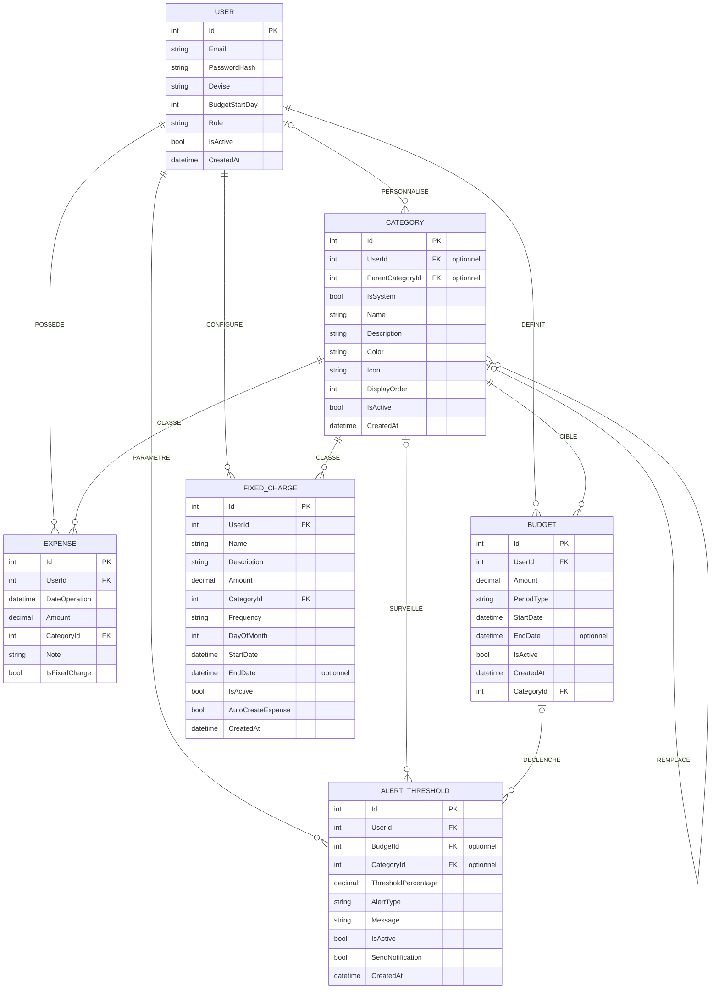

# Modele conceptuel de donnees - MCD MERISE

Ce MCD est derive du diagramme de classes du domaine MoneyMate.

## Diagramme MCD

## Entites

### USER

Utilisateur de l'application.

Identifiant : `Id`

Proprietes :

- `Email`
- `PasswordHash`
- `Devise`
- `BudgetStartDay`
- `Role`
- `IsActive`
- `CreatedAt`

### CATEGORY

Categorie de classement des operations, budgets et charges fixes.

Identifiant : `Id`

Proprietes :

- `UserId`, optionnel : categorie personnalisee par un utilisateur
- `ParentCategoryId`, optionnel : categorie systeme remplacee par une categorie personnalisee
- `IsSystem`
- `Name`
- `Description`
- `Color`
- `Icon`
- `DisplayOrder`
- `IsActive`
- `CreatedAt`

### EXPENSE

Depense saisie par un utilisateur.

Identifiant : `Id`

Proprietes :

- `UserId`
- `DateOperation`
- `Amount`
- `CategoryId`
- `Note`
- `IsFixedCharge`

### BUDGET

Budget defini pour une periode et une categorie.

Identifiant : `Id`

Proprietes :

- `UserId`
- `Amount`
- `PeriodType`
- `StartDate`
- `EndDate`, optionnel
- `IsActive`
- `CreatedAt`
- `CategoryId`

Les attributs `Year`, `Month` et `MonthLabel` du diagramme UML sont calcules a partir de `StartDate`. Ils ne sont donc pas retenus comme attributs conceptuels persistants du MCD.

### FIXED_CHARGE

Charge fixe recurrente configuree par un utilisateur.

Identifiant : `Id`

Proprietes :

- `UserId`
- `Name`
- `Description`
- `Amount`
- `CategoryId`
- `Frequency`
- `DayOfMonth`
- `StartDate`
- `EndDate`, optionnel
- `IsActive`
- `AutoCreateExpense`
- `CreatedAt`

### ALERT_THRESHOLD

Seuil d'alerte budgetaire parametrable par l'utilisateur.

Identifiant : `Id`

Proprietes :

- `UserId`
- `BudgetId`, optionnel
- `CategoryId`, optionnel
- `ThresholdPercentage`
- `AlertType`
- `Message`
- `IsActive`
- `SendNotification`
- `CreatedAt`

## Associations MERISE

### POSSEDER

Relie `USER` et `EXPENSE`.

Cardinalites :

- `USER` : `(0,N)` depenses
- `EXPENSE` : `(1,1)` utilisateur

Regle de gestion : une depense appartient toujours a un seul utilisateur.

### DEFINIR

Relie `USER` et `BUDGET`.

Cardinalites :

- `USER` : `(0,N)` budgets
- `BUDGET` : `(1,1)` utilisateur

Regle de gestion : un budget est defini par un seul utilisateur.

### CONFIGURER

Relie `USER` et `FIXED_CHARGE`.

Cardinalites :

- `USER` : `(0,N)` charges fixes
- `FIXED_CHARGE` : `(1,1)` utilisateur

Regle de gestion : une charge fixe est configuree par un seul utilisateur.

### PARAMETRER

Relie `USER` et `ALERT_THRESHOLD`.

Cardinalites :

- `USER` : `(0,N)` seuils d'alerte
- `ALERT_THRESHOLD` : `(1,1)` utilisateur

Regle de gestion : un seuil d'alerte appartient toujours a un utilisateur.

### PERSONNALISER

Relie `USER` et `CATEGORY`.

Cardinalites :

- `USER` : `(0,N)` categories personnalisees
- `CATEGORY` : `(0,1)` utilisateur

Regle de gestion : une categorie peut etre systeme, donc sans utilisateur, ou personnalisee par un seul utilisateur.

### CLASSER_DEPENSE

Relie `CATEGORY` et `EXPENSE`.

Cardinalites :

- `CATEGORY` : `(0,N)` depenses
- `EXPENSE` : `(1,1)` categorie

Regle de gestion : une depense est classee dans une seule categorie.

### CIBLER_BUDGET

Relie `CATEGORY` et `BUDGET`.

Cardinalites :

- `CATEGORY` : `(0,N)` budgets
- `BUDGET` : `(1,1)` categorie

Regle de gestion : un budget cible une seule categorie selon le diagramme de classes fourni.

### CLASSER_CHARGE_FIXE

Relie `CATEGORY` et `FIXED_CHARGE`.

Cardinalites :

- `CATEGORY` : `(0,N)` charges fixes
- `FIXED_CHARGE` : `(1,1)` categorie

Regle de gestion : une charge fixe est classee dans une seule categorie.

### SURVEILLER_CATEGORIE

Relie `CATEGORY` et `ALERT_THRESHOLD`.

Cardinalites :

- `CATEGORY` : `(0,N)` seuils d'alerte
- `ALERT_THRESHOLD` : `(0,1)` categorie

Regle de gestion : un seuil d'alerte peut surveiller une categorie, mais ce rattachement est optionnel.

### DECLENCHER_SUR_BUDGET

Relie `BUDGET` et `ALERT_THRESHOLD`.

Cardinalites :

- `BUDGET` : `(0,N)` seuils d'alerte
- `ALERT_THRESHOLD` : `(0,1)` budget

Regle de gestion : un seuil d'alerte peut etre associe a un budget precis, mais ce rattachement est optionnel.

### REMPLACER

Association reflexive sur `CATEGORY`.

Cardinalites :

- categorie systeme remplacee : `(0,N)` categories de remplacement
- categorie personnalisee de remplacement : `(0,1)` categorie parente

Regle de gestion : une categorie personnalisee peut remplacer une categorie systeme via `ParentCategoryId`.

## Regles de gestion synthetiques

- Un utilisateur peut posseder plusieurs depenses, budgets, charges fixes, seuils d'alerte et categories personnalisees.
- Une depense, un budget et une charge fixe appartiennent chacun a un seul utilisateur.
- Une depense et une charge fixe sont rattachees a une seule categorie.
- Une categorie peut etre globale au systeme ou personnalisee par un utilisateur.
- Une categorie personnalisee peut remplacer une categorie systeme.
- Un seuil d'alerte appartient a un utilisateur et peut cibler un budget, une categorie, ou rester global selon les champs optionnels.
